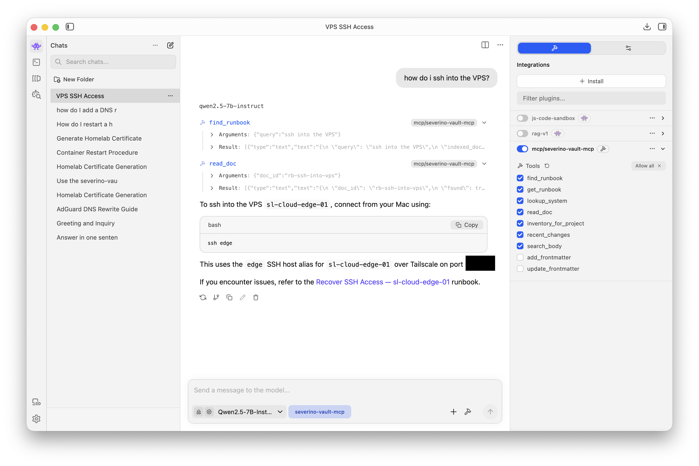

# severino-vault-mcp

[](https://github.com/joeseverino/severino-vault-mcp/actions/workflows/ci.yml)
[](https://github.com/joeseverino/severino-vault-mcp/actions/workflows/codeql.yml)
[](https://github.com/joeseverino/severino-vault-mcp/actions/workflows/pip-audit.yml)
[](https://scorecard.dev/viewer/?uri=github.com/joeseverino/severino-vault-mcp)


[](LICENSE)

Local-first MCP server for turning an Obsidian-style operations vault into
usable AI context without exposing credential-adjacent material by default.
It can run entirely on a Mac with a local model and a local MCP client, so
private vault context does not have to be sent to a hosted model.

It is built for security-minded operators, consultants, and small teams who
keep runbooks, infrastructure notes, decision records, and client/lab
procedures in markdown. The server runs over stdio, reads local files only,
and gives MCP clients a reliable way to answer operational questions from the
operator's actual documentation instead of generic model memory.

## Architecture

`severino-vault-mcp` is a local adapter between an MCP client and an
operator-owned markdown vault. It does not host a web service, proxy arbitrary
commands, or require a database. At startup it reads configuration, indexes the
configured vault folders, registers FastMCP resources and tools, and serves
requests over stdio from the MCP host. The important boundary is simple: the
MCP can only see files the local user can read, under folders the operator
explicitly indexes.

The project has two first-class surfaces. The generic vault surface is reusable
by anyone with an Obsidian-style operations vault: Quick Index navigation,
stable `doc_id` lookups, runbook search, project inventory, body search with
restricted-doc exclusion, and narrow frontmatter maintenance tools. The
jseverino.com surface is the real operator workflow this MCP was built around:
fixed-purpose tools for writeup readiness, technology taxonomy checks,
featured-order maintenance, contact/CSP review, and live security-header
checks. It is visible here on purpose as portfolio-grade evidence of how the
generic pattern works in production; other operators can run the generic
surface as-is and use the jseverino.com tools as a blueprint for their own
fixed local workflows.

See [`docs/architecture.md`](docs/architecture.md) for the full runtime model,
data contract, extension pattern, and adoption guidance. See
[`docs/operator-workflows.md`](docs/operator-workflows.md) for the real
jseverino.com workflow pack and [`docs/ai-tool-contract.md`](docs/ai-tool-contract.md)
for the compact tool-selection contract used to keep AI sessions fast.

## Why It Is Useful

- Grounds AI assistants in real runbooks before they answer.
- Works with local models running on the operator's Mac, including small models
  that need direct runbook hints instead of multi-step tool choreography.
- Exposes stable resources such as `vault://quick-index` and
  `vault://doc/{doc_id}`.
- Searches vault metadata and markdown bodies without requiring a database.
- Uses modern Rust-based file tooling — `ripgrep` for structured body search
  and `fd` for fast vault indexing — instead of reinventing them in Python.
- Enforces a sensitivity gate for credential-adjacent procedures.
- Provides narrow, validated frontmatter write tools for maintaining a vault.
- Uses a copyable TOML config and environment overrides for fast adoption.
- Has no HTTP listener, no hosted service, and no remote auth surface.

## Who This Is For

Best fit:

- Homelab and small-team operations documentation.
- MSP or client operations notes where procedures need to be repeatable.
- Cybersecurity lab runbooks and training environments.
- Incident response, recovery, and infrastructure maintenance notes.
- Internal "how do I operate this system?" documentation.

Not a great fit:

- Generic personal note-taking with no operational structure.
- Vaults where you do not want to add frontmatter.
- Multi-user hosted knowledge bases that need server-side auth.
- Replacing secret management, password vaults, or filesystem permissions.

## Quick Start

```bash
git clone git@github.com:joeseverino/severino-vault-mcp.git
cd severino-vault-mcp
uv sync --extra dev
scripts/check.sh
SVMC_VAULT_PATH=examples/sample-vault uv run --no-editable severino-vault-mcp
```

That starts a stdio MCP server pointed at the included sample vault. Wire it
to an MCP client, then ask the client to read `vault://quick-index`.

Before wiring a real vault, validate it:

```bash
SVMC_VAULT_PATH=/absolute/path/to/your/vault severino-vault-mcp doctor --propose
```

For a persistent local install:

```bash
uv tool install --from . severino-vault-mcp
mkdir -p ~/.config/severino-vault-mcp
cp config.example.toml ~/.config/severino-vault-mcp/config.toml
```

### Native Tool Dependencies

| Tool | Required? | Used For | Install |
|---|---|---|---|
| [`ripgrep`](https://github.com/BurntSushi/ripgrep) (`rg`) | Required for `search_body` | Structured (`--json`) body search across vault markdown, skipping frontmatter blocks | `brew install ripgrep` / `apt-get install ripgrep` |
| [`fd`](https://github.com/sharkdp/fd) | Optional, recommended | Fast indexed-dir walking in the vault loader. Falls back to `pathlib.rglob` when missing. | `brew install fd` / `apt-get install fd-find` |

Both are pure Rust binaries with no runtime dependencies. CI installs `ripgrep`
on every job so the body-search test suite always runs against the same tool
production uses.

Edit `~/.config/severino-vault-mcp/config.toml` and set `vault.path` to your
vault root.

## MCP Surface

The generic surface works against any configured operations vault that follows
the frontmatter contract in this README. These tools are the reusable product
surface.

| Resource | Type | What it returns |
|---|---|---|
| `vault://quick-index` | resource | The Quick Index navigation hub (`report-playbook-mcp-index`) |
| `vault://doc/{doc_id}` | resource template | One stable vault doc rendered as markdown, with the same sensitivity policy as `read_doc` |

| Tool | Read or write | What it answers |
|---|---|---|
| `find_runbook(query, limit=5)` | read | "How do I add an HTTPS proxy host?" |
| `get_runbook(query, limit=5)` | read | Single-call search + selected doc body for local models that are weaker at multi-step tool use. |
| `lookup_system(name)` | read | "Tell me about AdGuard Home" |
| `read_doc(doc_id)` | read | Returns one doc by stable ID or configured local alias. Missing-doc responses tell the assistant which discovery tool to use next. |
| `inventory_for_project(slug)` | read | "What docs are part of client-edge-dns?" |
| `recent_changes(days=7)` | read | Recent vault commits within indexed folders |
| `search_body(query)` | read | Full-text body search with frontmatter skipped and `restricted` bodies excluded. |
| `add_frontmatter(...)` | write | Prepends a validated frontmatter block to a vault doc that does not have one. |
| `update_frontmatter(...)` | write | Updates frontmatter fields. `doc_id` is immutable. |

The jseverino.com surface is the production workflow pack. It stays explicit
because it is the fastest path for the author's publishing and operations
workflows, and because it shows reviewers the concrete systems this MCP
orchestrates. The portable part is the pattern: fixed paths, fixed schemas,
structured reads, and narrow writes.

| Tool | Read or write | What it answers |
|---|---|---|
| `list_contact_submissions(limit=10)` | read | Recent `jseverino.com` contact submissions from the fixed Cloudflare D1 database. |
| `list_csp_reports(limit=20, directive=None)` | read | Recent filtered CSP violation reports from the fixed Cloudflare D1 database. |
| `count_csp_reports()` | read | Total and by-directive CSP report counts. |
| `check_jseverino_security_headers(path="/")` | read | Live `jseverino.com` HEAD check for CSP/reporting/security headers. |
| `list_featured_writeup_order()` | read | Fast path for the current featured/home-cloud writeup order. Returns only slot, slug, title, published, and featured. |
| `list_writeups(filter="all")` | read | Enumerate writeups under `05 Writeups/<slug>/index.md` with `published`, `featured`, and `featured_order` summarized. Filters: `all`, `published`, `draft`, `featured`. |
| `get_technology_catalog()` | read | Parse the slug catalog at `06 Pages/_technology-groups.md` and return slugs grouped by section with their featured state. |
| `find_writeups_using_tag(slug)` | read | List writeups whose `technologies:` reference a given tag. Use to confirm a tag is earned before promoting it to featured on the home cloud. |
| `validate_writeup(slug)` | read | Publish-readiness report for a writeup: frontmatter completeness, tech slugs vs the catalog, body images vs files on disk, and `related_projects` / `related_assets` resolvability against the indexed vault. |
| `prepare_writeup_publish(slug, include_tag_usage=False)` | read | ONE-CALL publish prep. Composes `validate_writeup` and `list_writeups("featured")` in one response; `include_tag_usage=True` additionally composes per-tag `find_writeups_using_tag` (off by default to keep the payload small). Use before every writeup commit instead of chaining the individual tools. |
| `apply_jseverino_d1_schema(confirm=False)` | write | Applies `db/schema.sql` to the fixed remote D1 database; requires `confirm=True`. |
| `update_writeup_frontmatter(slug, ...)` | write | Single-writeup scalar updates (title, description, published, published_at, last_reviewed, cover_image, featured, featured_order). Mirrors `update_frontmatter` for the writeup schema; only changed lines are mutated. |
| `reorder_featured(slug, position)` | write | Atomically reorders the featured-writeups list. Insert at `position`, move from current slot, or unfeature (`position=0`). Resulting order is guaranteed sequential 1..N. |

CLI helpers:

```bash
severino-vault-mcp doctor --propose
```

Validates required frontmatter fields in the configured vault and prints
starter frontmatter for markdown files that are not yet indexed.

```bash
severino-vault-mcp prepare-writeup-publish <slug> [--pretty] [--include-tag-usage]
```

Runs `prepare_writeup_publish` for one writeup slug, prints the JSON
result to stdout (compact by default; `--pretty` indents for humans),
exits 0 if `ok: true` (safe to publish) or 1 if there are blockers,
missing tech slugs, missing images, or unresolved `related_projects` /
`related_assets`. Intended to be wrapped by shell tooling (the
operator's `site publish-writeup <slug>` macro uses it as the
pre-flight gate before `site publish-all`). Pass
`--include-tag-usage` if you need the per-technology usage stats.

```bash
severino-vault-mcp touch-reviewed "<vault-relative-path>" [--pretty]
```

Sets `last_reviewed` to today on one vault doc, via `update_frontmatter`
(schema-validated, reloads the vault cache), prints the JSON result, and
exits 0 if `ok: true` or 1 otherwise. Intended to be wrapped by shell
tooling: the operator's drift guards (`cf-dns` / `adguard` / `nginx` /
`ts-acl`) call it after a successful `pull` so the vault mirror's review
date moves with the pull — a pull is a review.

### Local jseverino.com Ops Helpers

The `jseverino.com` helpers are intentionally fixed-purpose wrappers, not a
generic shell bridge. They call the operator's known Cloudflare D1 database
(`jseverino-contact` by default) and live site origin (`https://jseverino.com`
by default). Override these only for local testing:

```bash
SVMC_JSEVERINO_D1_DATABASE=alternate-db
SVMC_JSEVERINO_SITE_REPO=~/Documents/Code/Projects/jseverino.com
SVMC_JSEVERINO_SITE_ORIGIN=https://jseverino.com
SVMC_JSEVERINO_WRITEUPS_DIR=~/Documents/Code/Severino Labs/05 Writeups
SVMC_JSEVERINO_TECH_GROUPS=~/Documents/Code/Severino Labs/06 Pages/_technology-groups.md
```

`list_contact_submissions`, `list_csp_reports`, and `count_csp_reports` require
`wrangler` on `PATH` and an authenticated Cloudflare session. The schema apply
tool is the only jseverino.com write helper and refuses to run unless
`confirm=True` is passed.

`list_writeups`, `get_technology_catalog`, `find_writeups_using_tag`, and
`validate_writeup` read the writeup folders and the technology catalog
directly from the vault — no Cloudflare credentials, no network. They default
to vault-relative paths (`05 Writeups/` and `06 Pages/_technology-groups.md`)
so most setups need no configuration.

## Adopt It For Your Vault

Your vault needs markdown files with YAML frontmatter under these folders by
default:

```text
01 Projects/
02 Infrastructure/
03 Runbooks/
```

Minimum frontmatter:

```yaml
---
doc_id: rb-example
title: Example Runbook
doc_type: runbook
system: Example System
environment: other
status: active
sensitivity: internal
tags:
  - example
---
```

Recommended docs:

- A Quick Index doc with `doc_id: report-playbook-mcp-index`.
- Runbooks with stable `rb-*` IDs.
- Infrastructure notes with stable `infra-*` IDs.
- Project indexes with stable `project-*` IDs.
- `sensitivity` values set deliberately: `public`, `internal`, `sensitive`,
  or `restricted`.

Real vaults are usually messy. Start with the validator:

```bash
SVMC_VAULT_PATH="/absolute/path/to/your/vault" severino-vault-mcp doctor
```

Add `--propose` to print starter frontmatter for files that are missing it:

```bash
SVMC_VAULT_PATH="/absolute/path/to/your/vault" severino-vault-mcp doctor --propose
```

Point the server at your vault with either TOML:

```toml
[vault]
path = "/absolute/path/to/your/vault"
indexed_dirs = ["01 Projects", "02 Infrastructure", "03 Runbooks"]
```

Or with environment variables:

```bash
SVMC_VAULT_PATH="/absolute/path/to/your/vault" \
SVMC_INDEXED_DIRS="01 Projects:02 Infrastructure:03 Runbooks" \
severino-vault-mcp
```

## MCP Client Examples

Claude Code after `uv tool install`:

```bash
claude mcp add severino-vault-mcp severino-vault-mcp
```

Claude Code from a checkout:

```bash
claude mcp add severino-vault-mcp \
  -e SVMC_VAULT_PATH="$PWD/examples/sample-vault" \
  -- uv run --no-editable --directory "$PWD" severino-vault-mcp
```

Claude Desktop:

```json
{
  "mcpServers": {
    "severino-vault-mcp": {
      "command": "severino-vault-mcp",
      "env": {
        "SVMC_VAULT_PATH": "/absolute/path/to/your/vault"
      }
    }
  }
}
```

Local model example using `qwen2.5-7b-instruct` on macOS with this MCP server:



See [docs/demo.md](docs/demo.md) for a transcript-style walkthrough and more
local usage examples.

## Configuration

`config.example.toml` is the recommended starting point. Copy it to:

```text
~/.config/severino-vault-mcp/config.toml
```

Environment variables override the config file and are useful for demos, CI,
and one-off runs.

| Var | Default | Purpose |
|---|---|---|
| `SVMC_CONFIG` | `~/.config/severino-vault-mcp/config.toml` | TOML config path |
| `SVMC_VAULT_PATH` | `~/Documents/vault` | Vault root |
| `SVMC_INDEXED_DIRS` | `01 Projects:02 Infrastructure:03 Runbooks` | Colon-separated subdirs the loader recurses into |
| `SVMC_ALIASES_PATH` | `<vault>/.svmc/aliases.toml` | Optional local phrase-to-`doc_id` aliases for private shorthand and smaller local models |
| `SVMC_METADATA_URL` | unset | Optional downstream metadata-system URL |
| `SVMC_CACHE_SECONDS` | `30` | How long the in-memory vault index stays warm |
| `SVMC_ALLOW_RESTRICTED_UNLOCK` | `false` | Enables hidden local unlock prompts for `read_doc(..., include_restricted=True)` |
| `SVMC_RESTRICTED_UNLOCK_HASH` | unset | Salted unlock hash, mainly for tests or temporary local use |
| `SVMC_RESTRICTED_UNLOCK_HASH_FILE` | `~/.config/severino-vault-mcp/restricted-unlock.sha256` | Local file containing the salted unlock hash |
| `SVMC_RESTRICTED_UNLOCK_KEYCHAIN_SERVICE` | `severino-vault-mcp` | macOS Keychain service name for the salted unlock hash |
| `SVMC_RESTRICTED_UNLOCK_KEYCHAIN_ACCOUNT` | `restricted-unlock` | macOS Keychain account name for the salted unlock hash |
| `SVMC_RESTRICTED_UNLOCK_AUDIT_LOG` | `~/.local/state/severino-vault-mcp/audit.log` | Local audit log for unlock attempts; no body content is logged |

### Local Aliases

Aliases are an optional local phrase-to-`doc_id` map. They are useful when a
model or operator naturally asks for "offline ca" or "cert generation" but the
vault uses stable IDs such as `infra-offline-ca` and
`rb-generate-internal-cert`.

By default aliases are loaded from:

```text
<vault>/.svmc/aliases.toml
```

Example:

```toml
[aliases]
"offline ca" = "infra-offline-ca"
"cert generation" = "rb-generate-internal-cert"
```

Aliases only resolve to indexed `doc_id` values, and normal sensitivity rules
still apply. A `restricted` doc found through an alias is still withheld
unless the caller explicitly requests `include_restricted=True` and the
local unlock policy approves it.

## Sensitivity Policy

| Sensitivity | `read_doc` returns |
|---|---|
| `public` | Full body. Safe to publish. |
| `internal` | Full body. Private operational context, but safe to enter an AI chat you control. |
| `sensitive` | Full body + advisory. Private but still safe to enter chat when handled deliberately. |
| `restricted` | Metadata only by default. May expose credentials, key paths, recovery flows, internal auth procedures, or escalation paths. Full body requires explicit request plus local unlock. |

Use `sensitive` only for material that is private but acceptable to place in
the assistant context. If a document could reveal credentials, private key
locations, recovery procedures, token rotation steps, break-glass access,
internal authentication flows, or escalation paths, mark it
`restricted`.

When in doubt, choose `restricted`. Mislabeling a secret-bearing procedure
as merely `sensitive` will cause the body to be returned to the MCP client.

## Threat Model

- The server runs locally over stdio under your user account.
- It does not expose an HTTP listener or remote API.
- It can read files your local account can read inside the configured indexed
  vault directories.
- It reduces accidental disclosure to AI chat context; it does not sandbox a
  malicious MCP host.
- A compromised MCP host can still ask for allowed tools. The local unlock
  prompt is the final boundary for `restricted` body release.
- Store actual credentials and private keys outside indexed markdown whenever
  possible.

To release one restricted body through the MCP, all conditions must pass:

- The caller requests `read_doc(..., include_restricted=True)`.
- `SVMC_ALLOW_RESTRICTED_UNLOCK=1` is set in the local MCP environment.
- A salted unlock hash is configured in macOS Keychain, a local hash file, or
  `SVMC_RESTRICTED_UNLOCK_HASH`.
- The local hidden-input prompt succeeds.

Do not type the unlock phrase into AI chat. The prompt is local-only, and the
unlock is valid for one `read_doc` request.

Recommended macOS setup stores the salted hash in Keychain, not the phrase:

```bash
HASH="$(python3 -c 'import getpass,hashlib,os; p=getpass.getpass("MCP unlock phrase: "); s=os.urandom(16); print(f"sha256:{s.hex()}:{hashlib.sha256(s + p.encode()).hexdigest()}")')"
security add-generic-password -U \
  -s severino-vault-mcp \
  -a restricted-unlock \
  -w "$HASH"
```

## Sample Vault

The included sample vault models a small network/security operations
environment:

- Client edge DNS and internal hostname resolution.
- AdGuard Home as a DNS/security filtering component.
- Nginx Proxy Manager for browser-facing internal services.
- Local PKI and an offline CA example that exercises `restricted`
  withholding.

It is intentionally safe demo data, but it follows the same frontmatter
contract as a real operations vault.

## Documentation

| Doc | Purpose |
|---|---|
| `QUICKSTART.md` | Command-first setup guide for sample-vault and real-vault adoption. |
| `CONTRIBUTING.md` | Local development, issue, PR, and release guidance. |
| `STRUCTURE.md` | File-by-file repository map. |
| `scripts/check.sh` | One-command local verification for lint, tests, version alignment, and sample-vault validation. |
| `scripts/prepare-release.sh` | Version-bump and changelog prep helper. |
| `scripts/release.sh` | One-command release wrapper for checks, tagging, pushing, and GitHub release creation. |
| `.gitmessage` | Commit message template for descriptive, reviewable commits. |
| `docs/demo.md` | Short transcript of the intended MCP assistant flow. |
| `docs/architecture.md` | Runtime model, data contract, generic surface, operator-extension pattern, and adoption guidance. |
| `docs/operator-workflows.md` | Real jseverino.com workflow pack, systems in use, and the portable workflow-pack pattern. |
| `docs/ai-tool-contract.md` | Compact AI-facing rules for fast tool selection and low-token workflow use. |
| `docs/migration-guide.md` | Messy-vault onboarding, doctor usage, and bad-doc-to-fixed-doc examples. |
| `docs/testing-ci.md` | Local test commands, CI matrix, and test coverage notes. |
| `docs/release-checklist.md` | Public release checklist. |
| `docs/ai-safety-security.md` | AI safety model, sensitivity gate, local unlock, audit logging, and threat assumptions. |
| `config.example.toml` | Copyable local configuration template. |
| `.github/SECURITY.md` | GitHub vulnerability reporting policy. |

## Status

v2.4.6. Stable local stdio MCP for routing AI assistants to an
Obsidian-style operational vault, with resource discovery, reproducible sample
vault, CI, docs, config-file support, restricted local unlock controls,
and Quick Index recommendations embedded in `find_runbook` / `get_runbook`
responses for smaller local models. The 2.4.x line adds a jseverino.com
writeup-publish surface: four read tools (`list_writeups`,
`get_technology_catalog`, `find_writeups_using_tag`, `validate_writeup`),
a composite `prepare_writeup_publish`, and two write tools
(`update_writeup_frontmatter`, `reorder_featured`) that make the publish
workflow safe end-to-end — directive docstrings tell calling sessions
to use these instead of grepping or hand-editing YAML. Demo screenshots
show local-model usage on macOS. Layered security tooling (CodeQL,
pip-audit, OSSF Scorecard, Dependabot) runs on every push, every PR, and
weekly. Downstream metadata-system integration is intentionally optional.

## License

MIT. See `LICENSE`.
