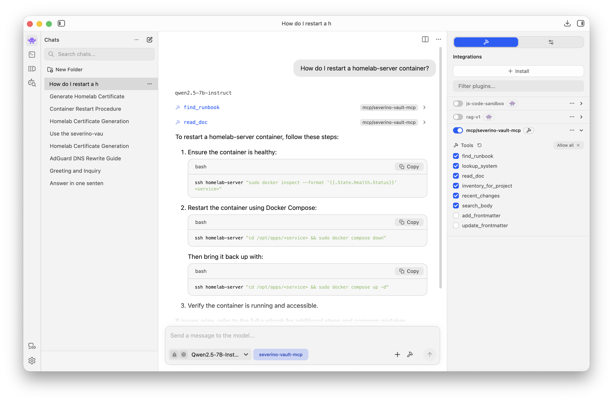

# Demo

This page has two separate demo surfaces:

- A safe sample-vault transcript that anyone can reproduce from
  `examples/sample-vault/`.
- Real local screenshots showing the same server pattern against a private
  operations vault from a Mac-hosted MCP client.

## Sample Vault Setup

```bash
SVMC_VAULT_PATH=examples/sample-vault uv run --no-editable severino-vault-mcp
```

The sample transcript below shows the intended MCP flow: broad questions start
at the Quick Index, then the assistant reads the specific target doc before
answering.

## Real Local Usage

These screenshots are not from the sample vault. They show
`severino-vault-mcp` connected to a private local operations vault from a
Mac-hosted MCP client using `qwen2.5-7b-instruct`. They are included as usage
proof; the copyable commands remain in the private vault runbooks.




## Sample Vault Transcript

### Broad Operational Question

User:

```text
How do I expose a new internal service over HTTPS?
```

MCP client action:

```text
Read resource: vault://quick-index
```

Relevant Quick Index row:

```text
Add HTTPS to an internal service -> rb-add-nginx-proxy-host
```

MCP client action:

```text
Read resource: vault://doc/rb-add-nginx-proxy-host
```

Assistant answer:

```text
Use the Add Nginx Proxy Host runbook.

1. Open Nginx Proxy Manager.
2. Add a proxy host for <service>.internal.example.
3. Set the forward hostname and port for the service container.
4. Attach the matching certificate.
5. Save and verify https://<service>.internal.example.
```

### Specific Runbook Question

User:

```text
What's the cert generation runbook?
```

MCP client action:

```text
Call tool: find_runbook("cert generation")
```

Expected top hit:

```text
rb-generate-internal-cert
```

MCP client action:

```text
Read resource: vault://doc/rb-generate-internal-cert
```

Assistant answer:

```text
Run:

cd ~/Documents/Code/Projects/cert-generator
./cert-gen <service>.internal.example

Then enter the CA key passphrase when prompted and confirm the certificate
output files were created.
```

### Secret-Adjacent Doc

User:

```text
Show me the offline CA doc.
```

MCP client action:

```text
Read resource: vault://doc/infra-offline-ca
```

Expected behavior:

```text
The MCP returns an advisory plus metadata. It does not return the body by
default because the doc is marked restricted.
```

If the user explicitly needs the body and accepts the risk, the client can
fall back to:

```text
Call tool: read_doc("infra-offline-ca", include_restricted=True)
```

Expected behavior:

```text
The MCP only releases the body if SVMC_ALLOW_RESTRICTED_UNLOCK=1 is set,
a local unlock hash is configured, and the hidden-input prompt on the Mac
succeeds. Otherwise it returns metadata, advisory text, and the unlock failure
reason. The unlock phrase is never entered into chat.
```
